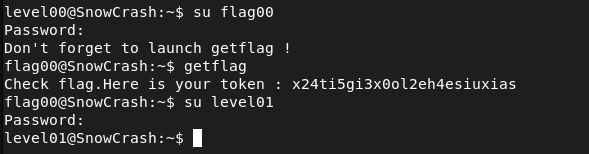

## STEPS

### 1. Initial Investigation:
Upon logging in, I started by conducting an initial investigation to identify any potential clues or files that may contain the password. To begin,  I thoroughly searched my home directory.

### 2. Using the 'find' Command:
Finding nothing of significance in the home directory, I utilized the find command to search the entire filesystem for files owned by the user flag00. The command I executed is as follows:
*find / -user flag00 2>/dev/null*
This command helped me discover two files named **/usr/sbin/john** and **/rofs/usr/sbin/john** , both files contained the same encrypted text : **cdiiddwpgswtgt**

### 3.decyption:
I turned to an online cipher identification tool to analyze and identify the encryption method used. Upon confirming that the encryption was indeed a *Caesar Cipher*, I utilized the same website to decrypt the encrypted text .
The decrypted text revealed the password: **nottoohardhere**

I then attempted this password for flag00, and it granted me access!

