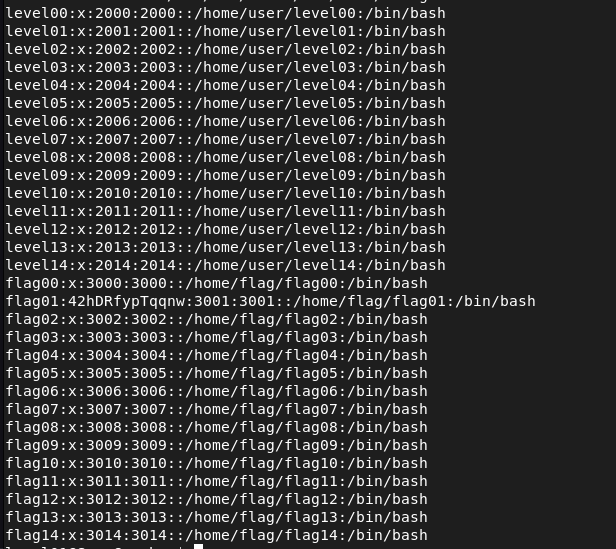
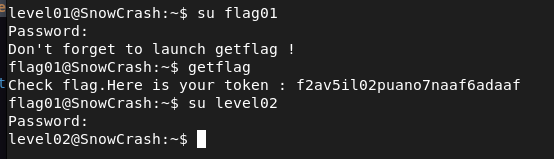

## STEPS

### 1. Initial Investigation:
Same as the level before, I started by an initial investigation by searching the home directory and using the find command to locate potential clues or files containing the password. However, both methods yielded no results.

### 2. Exploring /etc/passwd:
Recognizing that the /etc/passwd file often contains user account information, including passwords, I decided to inspect its contents. Upon reading the file, I discovered that it contained entries for all levels, with passwords represented by 'x'. For flag01, it displayed the string **42hDRfypTqqnw**.

### 3.decyption:
Initially, I attempted to use the string **42hDRfypTqqnw** directly as a password, but it did not grant access. Suspecting that it might be encrypted, I tried decrypting it using various online decryption tools without success.
In a further attempt to decrypt the password, I utilized the powerful password-cracking tool, **John the Ripper**. After running John the Ripper on the **42hDRfypTqqnw** string, it successfully decrypted it to **abcdefg**

I then attempted *abcdefg* for flag01, and it granted me access to the next level.
