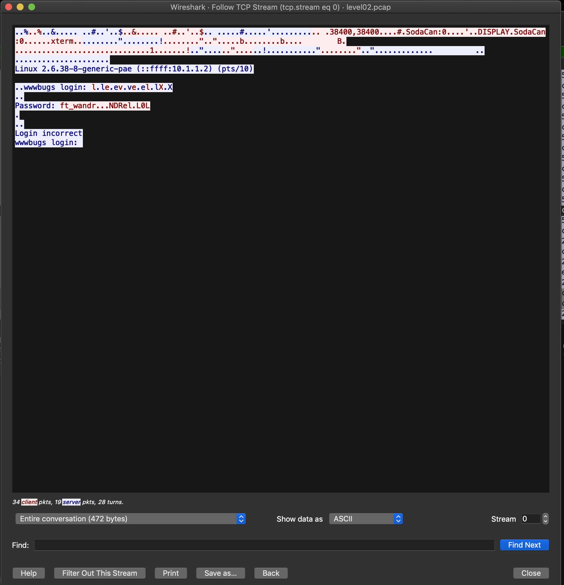
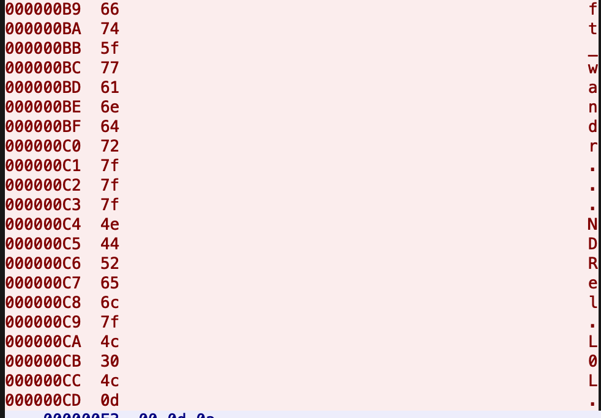
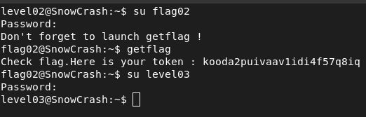

## STEPS

### 1. Initial Investigation:
This time , there was a file named level02.pcap in the home directory.
So the first thing i did was research what PCAP file is.
I found out that a PCAP (Packet Capture) file is a binary data file that contains network packet data captured during network traffic analysis. These files are commonly created by network protocol analyzers or packet sniffers.
To analyze the contents of level02.pcap on my local machine, I used the scp command to securely copy the file. 

**scp -P 4242 level02@10.12.174.84:level02.pcap .**

### 2. Exploring level02.pcap file:
With the PCAP file copied to my local machine, I decided to utilize *Wireshark* for further analysis. *Wireshark* is a powerful network protocol analyzer that allows users to capture and interactively browse the traffic running on a computer network. It provides detailed information about network packets and can be used for network troubleshooting, analysis, software and protocol development, and education.

After performing a TCP STREAM analysis of the file in Wireshark, I found a password within it: "ft_wandr...NDRel.L0L."

I attempted to use this password, but it didn't work. Determined to proceed with the investigation, I decided to delve deeper.

I tried reading the file in hex dump format, and upon closer inspection, I noticed something peculiar about the representation of the period (.) character.

Upon rechecking the hex values of each character, I discovered that they were all correct except for the periods. The hex value for the first four periods was DEL (7F), and for the last period, it was 0D, which corresponds to the carriage return (Enter) character.

After making these modifications, the password became **ft_waNDReL0L**. I tried using it as the password, and it worked successfully and granted me access to the next level.
