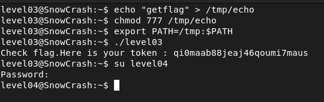

## STEPS

### 1. Initial Investigation:
Upon exploring the home directory, I discovered an executable named level03. When executed, it simply printed "Exploit me".

### 2. Decomiling the Executable:
To understand the inner workings of the level03 executable, I decided to decompile it. I used the website dogbolt.org to decompile the binary. The decompiled code revealed that the executable sets the effective group ID (EGID) and effective user ID (EUID) before executing the command /usr/bin/env echo Exploit me.
After analyzing the decompiled code, I noticed that the executable uses the *echo* command to print "Exploit me". This presented an opportunity for privilege escalation.

To exploit the vulnerability, I decided to manipulate the PATH environment variable. I created a file named echo in the /tmp/ directory and inserted the getflag command into it. I then granted full permissions to the echo file using chmod 777. Next, I updated the PATH environment variable to include the /tmp/ directory before the default system paths by executing the command : 

**export PATH=/tmp:$PATH**

This ensured that when the level03 executable was run, it would use my modified echo command located in the /tmp/ directory, which would execute getflag and print the flag instead.

### 3.Executing the Exploit:
When I executed the level03 executable. As anticipated, the exploit successfully executed the getflag command, retrieving the flag and printing it to the terminal.

This method of exploiting vulnerabilities by manipulating the PATH environment variable is known as **Linux Privilege Escalation Using PATH Variable** and is a common technique used in system exploitation.