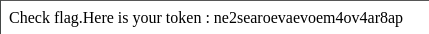

## STEPS

### 1. Initial Investigation:
Upon exploring the home directory, I found a Perl script that appears to be a CGI script designed to run on a web server. The script is named level04 and has the following content:

```
#!/usr/bin/perl
# localhost:4747

use CGI qw{param};
print "Content-type: text/html\n\n";
sub x {
    $y = $_[0];
    print echo $y 2>&1;
}
x(param("x"));
```

### 2.Exploiting the Script:
After examining the script, I observed that it accepts a parameter named x through a CGI request and passes it to the x subroutine. Within the x subroutine, the parameter is assigned to the variable $y, and then it attempts to execute the command echo $y 2>&1 and print the output.

Initially, I attempted to execute the command getflag by passing it directly as the value of the x parameter (x=getflag). However, this attempt did not succeed; it only printed getflag back as plain text.

Realizing that the script is executing the command echo $y 2>&1, I decided to exploit it by leveraging the shell's capability to execute multiple commands separated by the pipe (|) character. I crafted the parameter value as **x=test|getflag**. This command would first execute test, and then the output of test would be piped into getflag.

With the crafted parameter value, I made a new request to the script (**x=test|getflag**). As anticipated, the script successfully executed the getflag command, retrieving the flag.


