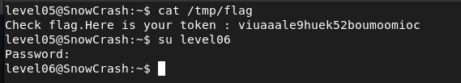

## STEPS

### 1. Initial Investigation:
Upon searching for files named level05 or flag05, I discovered a file containing the following content:

```
*/2 * * * * su -c "sh /usr/sbin/openarenaserver" - flag05
```

After some research, I realized that this is a cron job. Cron is a time-based job scheduler in Unix-like operating systems, and this cron job is scheduled to run every 2 minutes with elevated privileges (su -c) as the user flag05.

To understand what the cron job does, I examined the script /usr/sbin/openarenaserver. The script had the following content:

```
#!/bin/sh

for i in /opt/openarenaserver/* ; do
    (ulimit -t 5; bash -x "$i")
    rm -f "$i"
done
```

It became apparent that this script iterates over all files in the directory /opt/openarenaserver/, executes each file using *bash*, limits the execution time to 5 seconds (ulimit -t 5), and then deletes the file.

### 2.Exploiting the Cron Job:
Understanding how the script works, I decided to exploit it by creating a new file in the directory /opt/openarenaserver/. I created a file named exploit.sh with the following content:

```
#!/bin/sh
getflag > /tmp/flag
```

This script would execute the getflag command and redirect the output to /tmp/flag.
With the exploit.sh script in place, I waited for approximately 2 minutes for the cron job to run.
After the cron job executed the exploit.sh script, I checked the contents of /tmp/flag by running cat /tmp/flag. As expected, the flag was stored in the file!

