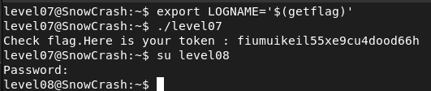

## STEPS

### 1. Initial Investigation:
In the home directory, I found en executable named level07.
I decompiled the binary using https://dogbolt.org/, which revealed the following C code:
```
int main(int argc,char **argv,char **envp)
{
	char *pcVar1;
	int iVar2;
	char *buffer;
	gid_t gid;
	uid_t uid;
	char *local_1c;
	__gid_t local_18;
	__uid_t local_14;`
	
	local_18 = getegid();
	local_14 = geteuid();
	setresgid(local_18,local_18,local_18);
	setresuid(local_14,local_14,local_14);
	local_1c = (char *)0x0;
	pcVar1 = getenv("LOGNAME");
	asprintf(&local_1c,"/bin/echo %s ",pcVar1);
	iVar2 = system(local_1c);
	return iVar2;

}
```

This code sets the effective group ID (EGID) and effective user ID (EUID) to the real group and user ID values, respectively. It then retrieves the value of the LOGNAME environment variable and uses it to construct a command to execute /bin/echo with the value of LOGNAME as an argument.

### 2.Exploiting the Binary:
Understanding that the binary executes /bin/echo with the value of LOGNAME, I decided to exploit it by manipulating the LOGNAME environment variable. I set **LOGNAME** to **$(getflag)** using the following command:

```
export LOGNAME='$(getflag)'
```
This sets LOGNAME to the result of executing the getflag command.
With the LOGNAME environment variable manipulated, I executed the level07 binary. As expected, it executed the command specified in the LOGNAME variable ($(getflag)) and printed the flag.

