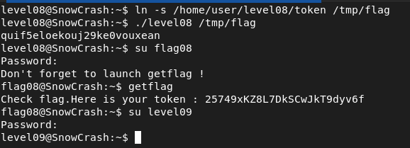

## STEPS

### 1. Initial Investigation:
In the home directory, I found an executable named level08 along with a file named token. When I attempted to execute level08 with token as an argument, it denied access, indicating that I may not access token.

I decompiled the level08 executable to understand its behavior. The decompiled code revealed that the program checks if the filename provided as an argument contains the substring "token". If it does, access is denied. Otherwise, it attempts to open the file, read its contents, and print them.

### 2.Exploiting the Executable:
Understanding that the flag is likely stored in the token file, I needed to bypass the access check. Since the program checks for the presence of "token" in the filename, I decided to create a symbolic link to the token file with a different name. By doing so, I could provide the new filename as an argument to the level08 executable, and it would read the contents of the token file without denying access.
I created a symbolic link named /tmp/flag that points to the token file using the following command:

```
ln -s /home/user/level08/token /tmp/flag
```

With the symbolic link created, I executed the level08 executable with /tmp/flag as the argument, and as expected, the program successfully read the contents of the token file (now accessed via the symbolic link) and printed them, allowing me to retrieve the flag.

