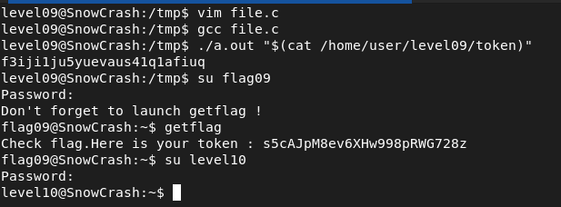

## STEPS

### 1. Initial Investigation:
In the home directory, I found an executable named level09 and a file named token. When executed without any arguments, level09 requires an argument.
After experimenting with various inputs, I observed that the output appears to be generated by encoding the input string using a specific algorithm. In this algorithm, each character is printed as its value added to its index position within the string. For example:
./level09 a → a
./level09 ab → ac
./level09 abcd → aceg

### 2.Reverse Engineering the Algorithm:
Realizing that the output might be an encoded form of the flag stored in the token file, I attempted to reverse engineer the encoding algorithm. I created a simple C program (file.c) that subtracts each character by its index to potentially decrypt the encoded string.


```
#include <unistd.h>

int main(int argc, char **argv) {
	if (argc == 2) {
		int i = 0;
		while (argv[1][i] != '\0') {
			char c = argv[1][i] - i; 
			write(1, &c, 1);
			i++;
		}
			write(1, "\n", 1);
	}
	return 0; 
}
```

I compiled the file.c program using gcc, and then executed it with the content of the token file as an argument. The program processed each character of the input string by subtracting its index, potentially revealing the original flag.

