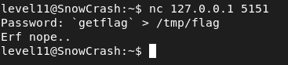
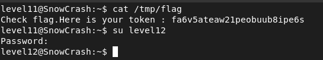

## STEPS

### 1. Initial Investigation:
In the home directory, a Lua script named level11.lua is found. 

```
#!/usr/bin/env lua
local socket = require("socket")
local server = assert(socket.bind("127.0.0.1", 5151))

function hash(pass)
  prog = io.popen("echo "..pass.." | sha1sum", "r")
  data = prog:read("*all")
  prog:close()

  data = string.sub(data, 1, 40)

  return data
end


while 1 do
  local client = server:accept()
  client:send("Password: ")
  client:settimeout(60)
  local l, err = client:receive()
  if not err then
      print("trying " .. l)
      local h = hash(l)

      if h ~= "f05d1d066fb246efe0c6f7d095f909a7a0cf34a0" then
          client:send("Erf nope..\n");
      else
          client:send("Gz you dumb*\n")
      end

  end

  client:close()
end
```

This script acts as a simple server that listens on port 5151, prompting users for a password. The password is hashed using SHA1 and compared against a hardcoded hash value. However, the script is vulnerable to command injection due to the unescaped use of user input in the hash() function.

### 2.Exploitation :
Upon examining the script, it became apparent that the hash() function utilizes io.popen() to execute shell commands without proper sanitization, making it vulnerable to command injection.

So I connected to the server using nc **127.0.0.1 5151**. The server prompted for a password. I entered a payload containing a command and a redirection to write the output to a file.



Despite receiving "Erf nope.." as a response, upon checking the /tmp/t file, I found the flag.

