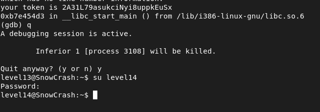

## STEPS

### 1. Initial Investigation:
In the home directory, there's an executable named level13. When executed, it prints "UID 2013 started us but we expect 4242".

Decompiling the executable reveals that the program checks if the UID is equal to 4242. If so, it prints the flag, which is the output of a hashing function.

### 2.Exploitation :
Since the flag is only printed when the UID is 4242, the task is to change the UID to 4242 during runtime. This can be achieved using a debugger like GDB.

```
gdb level13
(gdb) break getuid
(gdb) run
(gdb) next
(gdb) set $eax = 4242
(gdb) next
```

1-Break at getuid: Set a breakpoint at the getuid function.
2-Change UID: When the breakpoint is hit, change the value of $eax (which stores the return value of getuid) to 4242.
3-Continue: Let the program continue execution.

After changing the UID to 4242, the program prints the flag as expected.

