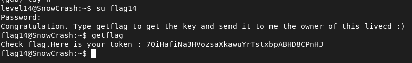

## STEPS

### 1. Initial Investigation:
After exhaustive searching, no obvious clues were found. So, I decided to inspect the getflag binary. Decompiling it, I found that it behaves similarly to the program of privoius level, checking the UID and giving the corresponding flag.

### 2.Exploitation :
Since the flag is only printed when the UID is 3014, the task is to change the UID to 3014 during runtime. This can be achieved using a debugger like GDB.

```
gdb /bin/getflag
(gdb) break ptrace
(gdb) run
(gdb) next
(gdb) set $eax = 0
(gdb) break getuid
(gdb) next
(gdb) set $eax = 3014
(gdb) next
```

1-Break at ptrace: Set a breakpoint at the ptrace function.
2-Change return value of ptrace: When the breakpoint is hit, change the value of $eax (which stores the return value of ptrace) to 0.
3-break at getuid: Set a breakpoint at the getuid function
4-Change return value of getuid: When the breakpoint is hit, change the value of $eax (which stores the return value of getuid) to 3014.
After changing the UID to 3014, the program prints the flag as expected.

